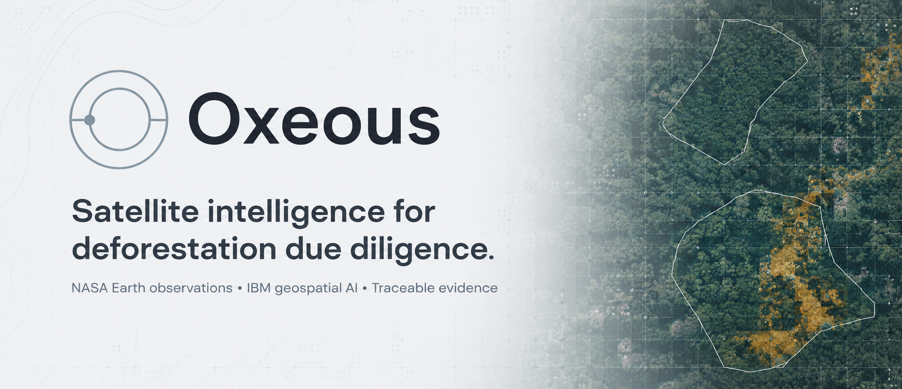

<p align="center">
  
</p>

<p align="center">
  
</p>

<h3 align="center">Ask the Earth. See the evidence.</h3>

<p align="center">
  A map-first conversational Earth observation platform with built-in EUDR compliance<br/>
  powered by <b>IBM Granite</b> · <b>IBM–NASA Prithvi-EO 2.0</b> · <b>NASA GIBS / STAC</b> · <b>Hansen GFC</b> · <b>ESA WorldCover</b>
</p>

<p align="center">
  <a href="https://fastapi.tiangolo.com"></a>
  <a href="https://nextjs.org"></a>
  <a href="https://maplibre.org"></a>
  <a href="#"></a>
  <a href="#"></a>
</p>

<p align="center">
  🌿 <b>EUDR Due Diligence</b> — verify commodity plots are deforestation-free per EU Regulation 2023/1115
</p>

---

## 🌍 What is Oxeous?

Oxeous is a **spatial intelligence dashboard controlled by conversation**. Type a natural-language question about any location on Earth — Oxeous uses IBM Granite to extract intent, fetches real satellite data from NASA, renders a georeferenced map layer, and explains the results in plain language.

```
User types → Granite extracts intent → Analysis tool fetches real satellite data
          → Map layer renders       → Granite explains the data-backed result
```

---

## ⚡ Quick Start

### Prerequisites

| Tool | Version |
|------|---------|
| Node.js | ≥ 20 |
| Python | ≥ 3.11 |
| Ollama | latest |
| Docker | ≥ 24 (optional) |

### 1. Install Granite

```bash
ollama pull granite3-8b
ollama serve
```

### 2. Start the backend

```bash
cd backend
pip install -e ".[dev]"
cp ../.env.example .env   # fill in NASA_EARTHDATA_TOKEN if you have one
uvicorn app.main:app --reload --port 8000
```

### 3. Start the frontend

```bash
cd frontend
npm install
npm run dev
```

Open [http://localhost:3000](http://localhost:3000) →  full-screen satellite map + conversation panel.

### 4. Docker Compose (all-in-one)

```bash
cp .env.example .env
docker compose -f infra/docker-compose.yml up
```

---

## 🏗️ Architecture

```
Browser (MapLibre GL JS + React)
  └── ConversationPanel  ──POST /chat──►  FastAPI backend
  └── MapCanvas          ◄── tile URLs ──  GraniteClient → ToolRegistry → Orchestrator
  └── LayerSidebar                         └── DataPipeline (pystac + rasterio + numpy)
                                           └── PrithviService (TerraTorch, background)
                                           └── CacheStore (diskcache / Redis)
```

See [`docs/architecture.md`](docs/architecture.md) for the full diagram.

---

## 📋 EUDR Compliance Module

Oxeous includes a full **EU Deforestation Regulation (EUDR) due diligence** capability:

| Step | What it does | Data source |
|------|-------------|-------------|
| **Upload plot** | Drag-drop GeoJSON polygon (commodity sourcing area) | Your supply chain data |
| **Deforestation check** | Was forest lost on this plot AFTER Dec 31 2020? | Hansen GFC v1.11 (30m annual) |
| **Forest baseline** | What was the land cover at the EUDR cutoff? | ESA WorldCover 2020 (10m) |
| **Real-time alerts** | Any GFW GLAD/RADD alerts since 2021? | Global Forest Watch API |
| **Protected areas** | Does the plot overlap any protected area? | WDPA Protected Planet API |
| **Country risk** | Is the country high/standard/low risk? | Built-in classification (80+ countries) |
| **Brazil MapBiomas** | Commodity-specific LULC verification for Brazil | MapBiomas Collection 8 (free COG) |
| **Risk score** | 0–100 compliance score + categorical risk level | Oxeous engine |
| **DDS export** | Download EU 2023/1115 Due Diligence Statement (JSON + TXT) | Oxeous generator |
| **Granite summary** | Plain-language explanation by IBM Granite | watsonx.ai / Ollama |

### Quick Examples (pre-loaded in the UI)

- 🌱 **Amazon soya plot, Mato Grosso, Brazil** — deforestation frontier
- 🍫 **Cocoa area, Bahia, Brazil** — Cerrado biome transition
- 🍫 **Cocoa farm, Ashanti, Ghana** — high-risk supply chain
- 🌴 **Palm oil concession, Kalimantan, Indonesia** — peatland deforestation

---

## 🛰️ Earth Observation Capabilities

| Capability | Data Source | Response Time |
|-----------|-------------|--------------|
| Vegetation moisture change (NDMI) | HLS S30 via LPCLOUD STAC | 6–12 s |
| Surface water extent | OPERA DSWx via CMR-STAC | 6–12 s |
| Land disturbance alerts | OPERA DIST via CMR-STAC | 6–12 s |
| True-color imagery | NASA GIBS (XYZ tiles) | < 1 s |
| Prithvi AI change detection | HLS S30 + TerraTorch | 30–90 s (background) |

---

## 💬 Example Prompts

```
Show vegetation moisture decline around Lahore this month
Where did surface water expand after recent rainfall in Bangladesh?
Show recent land disturbance hotspots in the Amazon this year
Compare vegetation conditions between this month and last month over Central Valley
Run AI change detection analysis on agricultural areas near Islamabad
```

---

## 📂 Repository Structure

```
oxeous/
  packages/shared-types/     TypeScript types shared by frontend and backend
  frontend/                  Next.js 14 + MapLibre GL JS + Tailwind + Zustand
  backend/                   FastAPI + Pydantic v2 + rasterio + TerraTorch
  infra/                     Docker Compose + Nginx config
  experiments/               Phase 0 validation scripts (run before development)
  docs/                      Architecture + API reference
```

---

## 🔐 Environment Variables

See [`.env.example`](.env.example) for a full list. Minimum required to run locally without NASA data:

```bash
GRANITE_DEPLOYMENT=ollama
GRANITE_MODEL=granite3-8b
```

NASA EarthData credentials enable COG windowed reads (NDMI, DSWx, DIST tools):
```bash
NASA_EARTHDATA_TOKEN=your_token_here
```

---

## 🧪 Running Tests

```bash
cd backend
pytest tests/unit/ -v                      # fast unit tests
pytest tests/integration/ -v               # requires FastAPI test client
```

---

## 🔬 Phase 0 Validation Experiments

Before full development, run the three validation experiments:

```bash
cd experiments/granite_tool_calling && python run.py
cd experiments/cog_read_perf && python run.py
cd experiments/prithvi_inference && python run.py
```

Each writes a `RESULT.md` with pass/fail outcome.

---

## 🧠 IBM Technology

| Technology | Role |
|-----------|------|
| **IBM Granite 3.x 8B Instruct** | Intent extraction, tool selection, result explanation |
| **IBM–NASA Prithvi-EO 2.0 100M** | Advanced change-detection segmentation (on-demand) |
| **TerraTorch** | Prithvi model loading, band preprocessing, tiled inference |

---

## 📄 License

MIT — See `LICENSE` for details.

---

<p align="center">
  <br/>
  <sub>Built with IBM watsonx. Powered by IBM Granite and IBM–NASA Prithvi.</sub>
</p>
