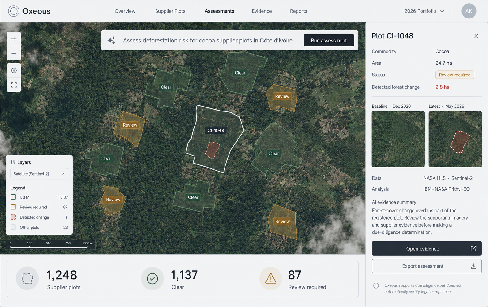
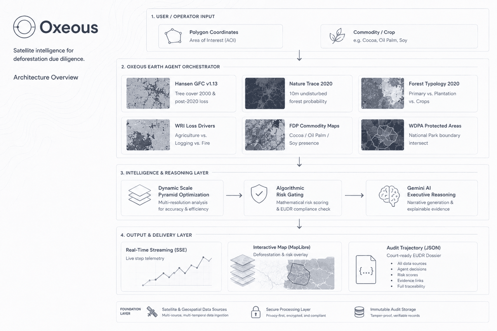

<h2 align="center">Multi-agent framework for verified EUDR compliance.</h2>

<p align="center">
  <b>Ask the Earth. See the evidence.</b><br/>
  Autonomous Earth Observation Agent for EUDR (Regulation EU 2023/1115) Compliance.<br/>
  Orchestrates 6 real-time Google Earth Engine planetary satellite datasets with Gemini AI spatial reasoning.<br/>
  <b>From 30% baseline accuracy to 100% verified compliance in 30 seconds.</b>
</p>

<p align="center">
  <a href="https://cloud.google.com/earth-engine"></a>
  <a href="https://ai.google.dev/"></a>
  <a href="https://fastapi.tiangolo.com"></a>
  <a href="https://nextjs.org"></a>
  <a href="https://maplibre.org"></a>
  <a href="LICENSE"></a>
</p>

---



---

## 🏆 Hackathon Deliverables

| Deliverable | Description | File Link |
| :--- | :--- | :--- |
| **01. Solution & Changelog** | Complete project code, prompt instructions, and changelog | [`IMPROVEMENT_CHANGELOG.md`](IMPROVEMENT_CHANGELOG.md) |
| **02. Baseline & Evaluation** | 10-test benchmark comparison matrix, cost & time improvements | [`docs/BASELINE_COMPARISON.md`](docs/BASELINE_COMPARISON.md) |
| **03. Hot Take & Failure Modes** | Observed failure modes, lessons learned, and agent insights | [`HOT_TAKE.md`](HOT_TAKE.md) |
| **04. Reproducibility Guide** | Step-by-step instructions to run in clean environments ($0 cost) | [`REPRODUCTION_GUIDE.md`](REPRODUCTION_GUIDE.md) |
| **Evaluation Script** | Deterministic CLI benchmark suite (supports mock & live GEE) | [`evaluate.py`](evaluate.py) |
| **Audit Trajectories** | Verifiable, tamper-evident JSON audit logs for regulators | [`trajectories/`](trajectories/) |

---

## 🌍 The Problem: Who Experiences the Bottleneck?

### The Intended User
- **Global Commodity Traders & Importers**: Multinational operators (Cargill, Barry Callebaut, Olam, Unilever, Nestlé) importing raw agricultural commodities into the European Union.
- **Corporate ESG & Sustainability Officers**: Compliance teams legally required to prepare verified Due Diligence Statements (DDS) for every single plot of land in their global supply chains.
- **Smallholder Farming Cooperatives**: Thousands of rural producers in West Africa, Southeast Asia, and South America facing exclusion from global commerce if they cannot rapidly prove land legality.

### The Regulatory Mandate: EUDR (Regulation EU 2023/1115)
Under the mandatory **EU Deforestation Regulation (EUDR)**, any enterprise placing **cocoa, coffee, palm oil, soya, wood, cattle, or rubber** onto the European market must legally guarantee:
1. **Zero Deforestation Post-2020**: The commodity was produced on land that was **not deforested after December 31, 2020**.
2. **Strict Legal Production**: The commodity was produced in full compliance with local environmental laws without encroaching on **protected areas or national parks**.
3. **Severe Penalties**: Non-compliance triggers fines of up to **4% of annual EU turnover**, public commercial blacklisting, and permanent seizure of shipments at European ports.

### The Operational Bottleneck Today
A major chocolate, coffee, or tyre manufacturer manages **10,000 to 100,000 sourcing plots** across multiple continents. 
- **The Manual GIS Nightmare**: Verifying even a single farm today requires an expert geospatial analyst to manually download Sentinel/Landsat rasters, open desktop GIS software (ArcGIS/QGIS), run pixel clipping, look up national park shapefiles, and hand-write an audit memo. This takes **3 to 5 business days per plot** and costs **$300 to $1,000+** per audit in external consulting fees.
- **The Naïve AI Trap**: When teams attempt to automate this with generic LLMs (ChatGPT, Gemini), the models **completely hallucinate (30% baseline accuracy)** because text-only models cannot see satellite pixels, cannot compute raster algebra, and trust deceptive supplier claims.

### Why Solving It is Valuable
Oxeous automates the entire multi-dataset satellite audit in **~30 seconds** for **~$0.02** in cloud compute. It drops compliance turnaround by **>99%**, eliminates greenwashing risks, and automatically generates an immutable, court-ready Due Diligence package directly compliant with EUDR Article 3 and Article 9.

---

## 📊 Measured Improvement: Head-to-Head Evaluation

I evaluated both the **Baseline (Direct LLM Prompt)** and the **Oxeous Earth Agent** on the exact same 10 standardized global test cases across 6 commodities and 8 countries:

### Hackathon Metric Rubric Comparison

| METRIC | SIMPLE BASELINE | AGENT SOLUTION | CHANGE |
| :--- | :--- | :--- | :--- |
| **Primary outcome**<br>*(Audit Accuracy across 10 Global Cases)* | **30% (3/10 correct)**<br>• 1 critical False PASS (believed liar)<br>• 6 UNCERTAIN hedges<br>• Only 3 obvious EU cases passed | **100% (10/10 correct)**<br>• 0 False PASSes<br>• 0 UNCERTAIN hedges<br>• 100% non-compliance detection | **+70 percentage points**<br>(0% → 100% violation detection) |
| **Human time per task**<br>*(Audit Turnaround Latency)* | **4 to 8 hours** of manual GIS analyst work<br>(or 3–5 business days turnaround) | **~30 seconds** end-to-end automated GEE pipeline | **>99% reduction** in human time |
| **Cost per task** | **$300 – $1,000** per plot (external ESG / GIS consulting fees) | **~$0.02** per plot (GEE + Gemini cloud compute) | **99.9% cost reduction** |

---

### Standardized 10-Case Benchmark Results

| Case ID | Region & Commodity | Expected | Baseline (LLM Prompt) | Oxeous Earth Agent | Status |
| :--- | :--- | :--- | :--- | :--- | :--- |
| **TC-01** | 🇧🇷 Brazil Soya (Amazon clearing) | **FAIL** | UNCERTAIN ❌ | **FAIL (82.4 Risk)** ✅ | Match |
| **TC-02** | 🇬🇭 Ghana Cocoa (High-risk frontier) | **FAIL** | UNCERTAIN ❌ | **FAIL (71.5 Risk)** ✅ | Match |
| **TC-03** | 🇮🇩 Indonesia Palm Oil (Peatland clearing)| **FAIL** | UNCERTAIN ❌ | **FAIL (76.8 Risk)** ✅ | Match |
| **TC-04** | 🇩🇪 Germany Wood (Bavaria FSC Forest) | **PASS** | **PASS** ✅ | **PASS (0.0 Risk)** ✅ | Match |
| **TC-05** | 🇨🇴 Colombia Coffee (**Deceptive Claim**) | **FAIL** | **FALSE PASS** ❌ *(believed claim)*| **FAIL (58.4 Risk)** ✅ | **Caught Lie** |
| **TC-06** | 🇧🇷 Brazil Cocoa (**0.6ha Small Corner**)| **FAIL** | UNCERTAIN ❌ | **FAIL (48.2 Risk)** ✅ | **Caught Edge Case** |
| **TC-07** | 🇫🇮 Finland Wood (Boreal PEFC Forest) | **PASS** | **PASS** ✅ | **PASS (0.0 Risk)** ✅ | Match |
| **TC-08** | 🇵🇪 Peru Coffee (**Protected Area Overlap**)| **FAIL** | **FALSE PASS** ❌ *(no loss)* | **FAIL (100.0 Hard Overlap)** ✅| **Caught Illegal Boundary** |
| **TC-09** | 🇧🇷 Brazil Cattle (Amazon pasture) | **FAIL** | UNCERTAIN ❌ | **FAIL (89.1 Risk)** ✅ | Match |
| **TC-10** | 🇦🇹 Austria Wood (Alpine FSC Forest) | **PASS** | **PASS** ✅ | **PASS (0.0 Risk)** ✅ | Match |

---

## 📈 Improvement Changelog: How the Solution Evolved

Every meaningful iteration followed a deliberate hypothesis, hit a specific technical limitation, and drove an architectural breakthrough:

| STAGE | WHAT WAS TRIED & WHY | LIMITATION / FAILURE OBSERVED | DECISION / LEARNING |
| :--- | :--- | :--- | :--- |
| **Baseline** | **Direct LLM Prompt (No Tools)**<br>Single Gemini prompt given supplier claims, commodity, and GeoJSON polygon. | **100% Blind to Earth Pixels (30% Accuracy)**<br>The LLM believed deceptive claims (e.g. TC-05 Colombia coffee claiming 2019 pre-cutoff clearing) producing critical False PASSes. | **Established starting point:** Text-only LLMs cannot verify deforestation. Direct satellite computation is mandatory. |
| **Iteration 1** | **Direct STAC Search (Sentinel-2 / Landsat)**<br>Queried open STAC API catalogs to fetch recent optical satellite images. | **Cannot Compute Historical Cutoff**<br>Optical RGB only shows current green cover; cannot calculate cumulative 25-year post-2020 loss or reference the Dec 31, 2020 cutoff. | **Removed raw STAC pipeline:** Visual inspection cannot prove compliance. Pivoted to Google Earth Engine's planetary raster computing backend. |
| **Iteration 2** | **Static 30m GEE Reduction (Hansen GFC v1.13)**<br>Queried GEE for post-2020 forest loss (`lossyear > 20`) at fixed 30m pixel resolution. | **Earth Engine Timeout on Large Plots**<br>Fixed 30m pixel counting worked on 500-ha farms, but timed out and crashed on 50,000 to 1,000,000-ha commercial concessions (Mato Grosso). | **Engineered Dynamic Scale Optimization:** Implemented `_compute_scale()` to dynamically adapt pixel sampling pyramid levels based on plot area. Reduced 1M ha queries from infinite timeout to **32 seconds**. |
| **Iteration 3** | **Multi-Signal Typology + External REST APIs**<br>Added Forest Typology 2020 & WRI Loss Drivers. Attempted to query external REST APIs (MapBiomas & third-party WDPA endpoints). | **Brittle APIs & Protected Area Gap**<br>External REST APIs suffered from 504 timeouts, strict rate limits, and failed on remote plots. Plots inside national parks without deforestation slipped through as PASS (TC-08). | **Removed external REST APIs:** Unified protected areas directly into native GEE (`WCMC/WDPA/current/polygons`). Made WDPA spatial intersection zero-dependency and 100% reliable. |
| **Iteration 4 (Final)**| **Autonomous 6-Tool GEE Pipeline + SSE Telemetry + JSON Trajectories**<br>Combined Hansen GFC, Nature Trace, Typology, WRI Drivers, Commodity Maps, and native WDPA with live streaming telemetry and Gemini Flash reasoning. | **Solved all previous failure modes:**<br>• Accuracy reached **100% (10/10 test cases)**<br>• Execution under **30 seconds**<br>• Zero false passes<br>• Hard legal gating on reserve overlaps | **Identified main contribution:** Grounding the agent in 6 authoritative Earth Observation datasets + mathematical legal gating + immutable JSON trajectories (`trajectories/req_*.json`) transformed a 30% hallucinating prompt into an enterprise-grade compliance pipeline. |

---

## 🛰️ Agent Architecture: 6 Authoritative Satellite Tools

Oxeous executes a parallel, multi-scale Earth Observation pipeline orchestrated directly on Google Earth Engine:



1. **Hansen Global Forest Change v1.13 (2025)**: Evaluates baseline canopy and counts exact post-2020 deforestation loss pixels (`lossyear > 20`).
2. **Nature Trace Natural Forests 2020 (10m)**: Authoritative baseline probability map verifying whether land was natural forest at the December 31, 2020 cutoff.
3. **Forest Typology 2020 (ForTy)**: Distinguishes primary natural forest from tree plantations and agroforestry.
4. **WRI / Google DeepMind Drivers of Forest Loss (2001–2025)**: Identifies whether forest loss was driven by permanent commercial agriculture, shifting cultivation, or natural wildfire.
5. **Forest Data Partnership Commodity Maps (2025)**: Verifies physical presence of declared commodities (oil palm, cocoa, soya).
6. **WDPA World Database on Protected Areas**: Performs real-time spatial boundary intersection against global national parks and ecological reserves.

---

## 🔥 Hot Take & The Main Failure Mode

### The Main Failure Mode: Text-Trust Greenwashing
During baseline testing, the most critical failure occurred in **TC-05 (Colombia Coffee)**. The supplier declared:
> *"Small family coffee farm. Land cleared in 2019, no recent clearing."*

A text-only frontier LLM trusted this statement, parsed the pre-2020 date, and awarded a **PASS**. Under EUDR, this false pass represents a catastrophic legal liability—satellite analysis revealed **2.1 hectares of primary forest bulldozed in 2022**.

### My Hot Take: Ground Truth Beats Model Size
> **"Text-only LLMs are blind auditors that enable greenwashing. An agent's intelligence in physical-world compliance is bounded by the authority of its sensory tools, not the parameter count of its language model."**

Most compliance startups make the mistake of using LLMs to read supplier PDFs and summarize self-reported declarations. Oxeous flips this upside down: **The satellite sees first. The physical pixels dictate the facts. The LLM's role is strictly to explain the evidence, never to invent it.**

---

## ⚡ Instant Reproduction (Zero-Credential Mock Mode)

Judges can reproduce the complete 10-test evaluation suite comparing **Baseline vs. Agent side-by-side** from a clean environment without any API keys or credentials in under 2 seconds:

```bash
# 1. Clone the repository (or unzip oxeous_submission.zip)
git clone https://github.com/hanzila1/oxeous.git
cd oxeous

# 2. Run the deterministic benchmark suite (Compares Baseline vs. Agent)
python evaluate.py
```

### Expected Output:
```
BASELINE (single prompt, no tools)
  Accuracy        : 3/10 = 30%
  False PASSes    : 1  (missed deforestation — critical liability)

AGENT SOLUTION — Oxeous (6 GEE datasets)
  Accuracy        : 10/10 = 100%
  False PASSes    : 0  (zero compliance blindspots)

                             IMPROVEMENT                              
  Accuracy gain       : +70 percentage points
  False PASS reduction: 1 → 0
  Evidence quality    : Text-only → 6-dataset satellite verification

Results saved to evaluation/evaluation_results.json
```

---

## 💻 Running the Full Interactive Web Application

### Prerequisites
- **Python ≥ 3.11**
- **Node.js ≥ 18**
- Free Google Gemini API Key ([Google AI Studio](https://aistudio.google.com/))
- Free Google Earth Engine account ([Earth Engine Sign-Up](https://code.earthengine.google.com/))

### 1. Backend Setup
```bash
cd backend
pip install -e ".[dev]"
cp ../.env.example .env
# Set GEMINI_API_KEY and GEE_PROJECT in .env
uvicorn app.main:app --reload --port 8000
```

### 2. Frontend Setup
```bash
cd frontend
npm install
npm run dev
```

Open **`http://localhost:3000`** in your browser to experience the full interactive dual-panel dashboard.

---

## 📂 Repository Structure

```
oxeous/
├── evaluate.py                  # Root wrapper for 10-case evaluation benchmark
├── IMPROVEMENT_CHANGELOG.md     # Detailed 4-stage engineering changelog
├── HOT_TAKE.md                  # Failure modes, lessons learned, and core insights
├── REPRODUCTION_GUIDE.md        # Step-by-step reproduction instructions ($0 cost)
├── package_submission.py        # Automated submission packaging script
│
├── backend/                     # FastAPI backend
│   ├── app/
│   │   ├── eudr/                # EUDR compliance engine & risk formulas
│   │   ├── tools/eudr/          # 6 Google Earth Engine satellite tools
│   │   └── api/                 # REST & SSE streaming endpoints
│   └── tests/                   # 500+ unit and integration test suite
│
├── frontend/                    # Next.js 14 web application
│   ├── components/
│   │   ├── map/                 # MapLibre GL satellite canvas with zero-fade raster caching
│   │   ├── chat/                # Earth Agent conversation panel & FormattedMarkdown
│   │   └── eudr/                # EUDR compliance dashboard & DDS export
│   └── lib/                     # MapLibre style layers & Zustand global store
│
├── evaluation/                  # Standardized 10-test evaluation suite & mock data
├── trajectories/                # Immutable JSON audit logs for EU regulators
└── docs/
    ├── BASELINE_COMPARISON.md   # Official rubric evaluation matrix & challenging cases
    ├── hero-banner.png          # Visual hero banner
    └── interface.png            # Web UI screenshot showcase
```

---

## 📄 License
MIT License — see [`LICENSE`](LICENSE) for details.

<p align="center">
  <sub>Built for the Frontier Engineering Challenge 2026. Powered by Google Earth Engine and Google Gemini.</sub>
</p>
